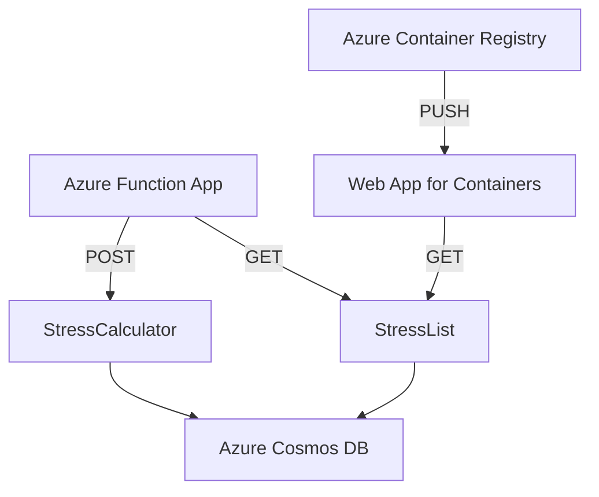
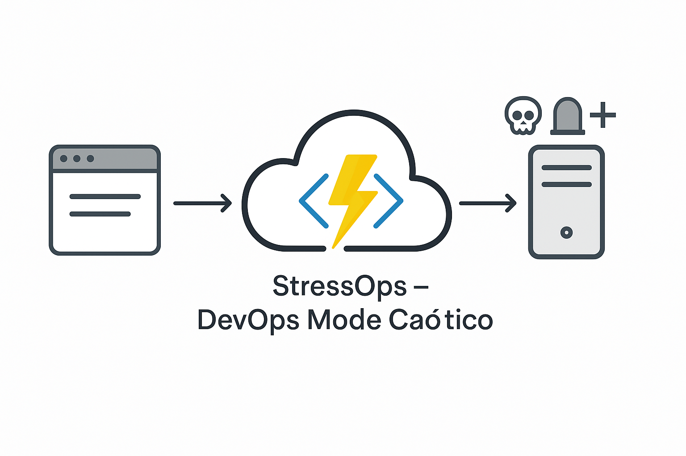

# 🚀 StressOps – DevOps Mode Caótico

Este projeto é um sistema completo (backend + frontend) para avaliação do nível de estresse de uma equipe DevOps com base em número de deploys, erros e tempo de resposta. Desenvolvido com **Azure Functions + React + Azure Container Registry + Web App for Containers**.

---

Uma Azure Function divertida e funcional que calcula o nível de **estresse da equipe DevOps** com base em três fatores:

- 🚀 Quantidade de deploys
- ❌ Número de erros
- ⏱️ Tempo médio de resposta da aplicação (em segundos)

---

## 📐 Lógica de Cálculo

A função recebe uma requisição `POST` com o seguinte payload:

```json
{
  "deploys": 5,
  "erros": 10,
  "tempoResposta": 1200
}
```

E retorna um JSON com o nível de estresse:

```json
{
  "nivelEstresse": "Zen",
  "emoji": "🧘‍♂️🌿",
  "mensagem": "Você é uma lenda da estabilidade."
}
```

O nível de estresse é calculado com base na seguinte fórmula:

```javascript
const score = deploys * 2 + erros * 5 + tempoResposta / 60;
```

O resultado é classificado em níveis de estresse:
| Nível de Estresse | Emoji | Mensagem |
|------------------|-------|----------|
< 50 | Zen | 🧘‍♂️🌿 | Você é uma lenda da estabilidade.
50 – 99 | Suado | 😅🚧 | Tá puxado, mas ainda sob controle.
100 – 199 | Caótico | 🔥💣 | Deploy em sexta-feira? Corajoso.
200+ | Sobrevivência | ☠️🪦 | Já pensou em abrir uma cafeteria?

## 📁 Estrutura do Projeto (Monorepo)

```
STRESSOPS-FUNCTION/
├── StressCalculator/      # Azure Function 1 (POST)
├── StressList/            # Azure Function 2 (GET)
├── stressops-web/         # Frontend React + CSS puro
├── host.json              # Configurações da Azure Function App
├── package.json           # Dependências do projeto de funções
```

---

## 🖼️ Diagrama da Arquitetura



---

## Link do Repositório

URL: [https://github.com/arijunior2020/stressops](https://github.com/arijunior2020/stressops)

---

<h3 align="center">Diagrama Simples</h3>

<div align="center">
  
</div>

## 🧠 Funcionalidade

- 🔢 Cálculo do nível de estresse via função `StressCalculator`
- 📋 Listagem de registros armazenados no Azure Cosmos DB via função `StressList`
- 🌐 Interface React moderna e leve com tema Light/Dark
- 🐳 Deploy do frontend com Docker no Azure Container Registry (ACR) + Web App

---

## 💻 Tecnologias utilizadas

- **Backend:**
  - Azure Functions (Node.js)
  - Azure Cosmos DB (API: Core SQL)
  - Azure Storage Account
  - Azure Container Registry (ACR)
  - Azure Web App for Containers
- **Frontend:**
  - React + Vite
  - TypeScript
  - CSS puro
  - Docker
- **DevOps:**
  - Azure DevOps (CI/CD)
  - GitHub Actions (opcional)
  - Azure CLI
- **Outras:**
  - Postman (para testes)
  - Visual Studio Code (IDE)
  - Git (controle de versão)
- **Documentação:**

  - Markdown (README)
  - Diagrama de arquitetura (Mermaid)
  - Documentação do Azure Functions e Cosmos DB

  ***

## 🔧 Estrutura Frontend

```bash
stressops-web/
├── public/                # Arquivos públicos (index.html, favicon, etc.)
├── src/                   # Código fonte do React
│   ├── components/        # Componentes React
│   ├── pages/             # Páginas do aplicativo
│   ├── styles/            # Estilos CSS
│   ├── App.tsx            # Componente principal
│   ├── index.tsx          # Ponto de entrada do React
│   └── vite-env.d.ts       # Tipos do Vite
├── .gitignore             # Arquivos a serem ignorados pelo Git
├── Dockerfile             # Dockerfile para build da imagem
├── package.json           # Dependências e scripts do projeto
├── tsconfig.json          # Configuração do TypeScript
├── vite.config.ts         # Configuração do Vite
└── README.md              # Documentação do projeto
```

### Dockerfile do frontend

```dockerfile
# Etapa 1: build da aplicação
FROM node:18-alpine AS builder
WORKDIR /app

COPY package*.json ./
RUN npm install

COPY . .
RUN npm run build

# Etapa 2: servidor Nginx para servir os arquivos
FROM nginx:alpine
COPY --from=builder /app/dist /usr/share/nginx/html
COPY nginx.conf /etc/nginx/conf.d/default.conf

EXPOSE 80
CMD ["nginx", "-g", "daemon off;"]
```

### Nginx.conf

```nginx
server {
  listen 80;
  server_name localhost;

  location / {
    root   /usr/share/nginx/html;
    index  index.html index.htm;
    try_files $uri /index.html;
  }

  error_page 404 /index.html;
}
```

## ⚙️ Passo a passo para replicar

### 1. **Criar os recursos no Azure**

- [ ] Grupo de Recursos (Resource Group)
- [ ] Azure Cosmos DB (API: Core SQL)
- [ ] Azure Storage Account (será criado automaticamente com a Function App)
- [ ] Azure Function App (Node.js)
- [ ] Azure Container Registry (ACR)
- [ ] Azure Web App for Containers

### 2. **Publicar o backend (Azure Functions)**

#### a) Ajustes iniciais

1. Crie os arquivos `local.settings.json` e configure os valores locais (se desejar rodar localmente)
2. Configure no portal da Function App:
   - `FUNCTIONS_WORKER_RUNTIME=node`
   - `AzureWebJobsStorage=<connection string do Storage Account>`
   - `CosmosDBConnection=<connection string do CosmosDB>`

#### b) Build e publicação

```bash
npm install
npm run build
```

```bash
func azure functionapp publish stressops-fn --typescript --script-root . --force
```

> 📌 Garanta que os arquivos `.js` da `dist/` ou do root estejam corretamente organizados e com `function.json` se estiver usando o modelo antigo.

---

### 3. **Buildar e publicar o frontend no ACR**

```bash
cd stressops-web
npm install
npm run build

# Build da imagem Docker
docker build -t stressops-web .

# Login no ACR
az acr login --name stressops

# Tag e push
docker tag stressops-web stressops.azurecr.io/stressops-web:1.0.0
docker push stressops.azurecr.io/stressops-web:1.0.0
```

---

### 4. **Criar o Web App for Containers no Azure**

1. Escolha a imagem do ACR manualmente:
   - **Image:** `stressops-web`
   - **Tag:** `1.0.0`
2. Use **Managed Identity** para autenticar no ACR
3. Após criar, vá até o ACR > IAM > Role Assignment e adicione a role `AcrPull` para o Web App (`stressops-webapp`)

---

## 🔐 Conexões Importantes

- `AzureWebJobsStorage`: da Storage Account criada junto da Function App
- `CosmosDBConnection`: da sua conta CosmosDB

---

## Liberação CORS

Para permitir que o frontend acesse a Function App, é necessário configurar o CORS (Cross-Origin Resource Sharing):

- Vá até a Function App no portal do Azure
- Clique em **CORS**
- Adicione o domínio do Web App (ex: `https://seuapp.azurewebsites.net`) e clique em **Salvar**
- Adicione também `http://localhost:5173` para testes locais
- Clique em **Salvar** novamente

## Após Web App publicado

- Acesse o URL do Web App (ex: `https://seuapp.azurewebsites.net`)
- O frontend deve carregar e fazer chamadas para a Function App
- Teste o formulário de envio de dados e verifique se os registros estão sendo salvos no CosmosDB
- Acesse a URL da Function App (GET) (ex: `https://seufunctionapp.azurewebsites.net/api/StressList`) para ver os registros salvos
- Acesse a URL da Function App (POST) (ex: `https://seufunctionapp.azurewebsites.net/api/StressCalculator`) para calcular o nível de estresse
- Verifique se o nível de estresse está sendo calculado corretamente com base nos dados enviados

## ✅ Funcionalidades prontas

- [x] Azure Function App com duas funções
- [x] Azure CosmosDB conectado
- [x] Frontend com React + CSS puro
- [x] Dockerfile pronto para build
- [x] Imagem publicada no ACR
- [x] Web App for Containers apontando para o ACR
- [x] Tema Dark/Light
- [x] Exibição do último resultado e histórico

---

## Prints do Projeto em Execução

- URL do Web App: [https://stressops-webapp-g0bnaeeague5aad0.westus3-01.azurewebsites.net/](https://stressops-webapp-g0bnaeeague5aad0.westus3-01.azurewebsites.net/)

- URL da Function App: [https://stressops-fn.azurewebsites.net/api/StressCalculator](https://stressops-fn.azurewebsites.net/api/StressCalculator)

- URL da Function App (GET): [https://stressops-fn.azurewebsites.net/api/StressList](https://stressops-fn.azurewebsites.net/api/StressList)

<div align="center">
  
  
  
  
  
  
  
</div>

---

## 👨‍💻 Desenvolvido pela Equipe

- **José Arimatéia Rodrigues Júnior - Matrícula 2417061**
- **Karime Linhares - Matrícula 2416877**
- **Bruno Negreiros - Matrícula 2419432**
- **Pedro Henrique - Matrícula 2325859**
- **Anderson Karl - Matrícula 2417571**
